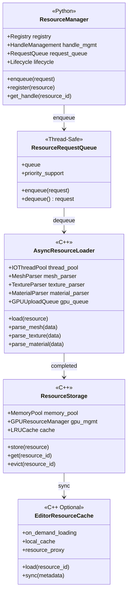

# RBC资源

通用的Mesh/Texture/Physics等资源很难达到最优和最灵活的存取，运行和同步效率，所以RBC引入了自定义资源类型，并支持将多种资源通过懒加载和预烘培引入到RBC Project中

## RBC资源管理系统

RoboCute资源管理系统是一个**Python-First、多线程、异步加载**的资源管理架构,用于支持Python Server与C++ Editor之间的资源同步。核心设计原则:

1. **Python为权威数据源**: 所有资源的生命周期由Python端管理
2. **异步加载**: 资源加载在后台线程进行,不阻塞主循环
3. **增量同步**: Server-Editor之间仅传输必要的资源元数据
4. **C++加速**: 资源的I/O密集型操作(解析、解码)在C++扩展中实现，更好地利用多线程
5. **统一资源系统**: 不依赖DCC工具,使用自定义资源格式

整体架构图




## RBC资源类型

#### .rbm (Mesh)
```
Header (20 bytes):
  uint32 magic ('RBM\0')
  uint32 version
  uint32 vertex_count
  uint32 index_count
  uint32 flags
Data:
  Vertex[] vertices
  uint32[] indices
```

#### .rbt (Texture)
```
Header (24 bytes):
  uint32 magic ('RBT\0')
  uint32 version
  uint32 width
  uint32 height
  uint32 depth
  uint32 mip_levels
  uint8 format
  uint8[3] reserved
Data:
  uint64 data_size
  uint8[] pixel_data
```

#### .rbm (Material)
```
Header (8 bytes):
  uint32 magic ('RBMT')
  uint32 version
Data:
  uint32 name_length
  char[] name
  float[4] base_color
  float metallic
  float roughness
  float[3] emissive
  uint32 base_color_texture
  uint32 metallic_roughness_texture
  uint32 normal_texture
  uint32 emissive_texture
  uint32 occlusion_texture
```