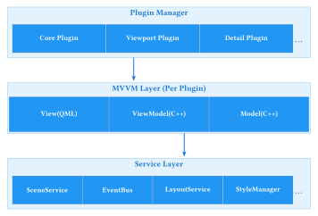

# RGC Editor in V0.3.0

本次更新对Editor的主要需求：

- [x] 接入RBCRuntime中的场景定义
- [x] 更新灵活的Workflow
- [x] 引入QML进行组件封装与样式定义
- [x] 支持样式热加载与调试模式（argv控制）
- [ ] 支持通用Plugin(DLL)加载与热更新
- [ ] 基于Plugin的MVVM架构，支持模块动态load/unload
- [ ] 更科学的大型Qt项目组织，支持子模块mock和可复用Component独立开发
- [ ] 支持调试渲染参数的Detail面板
- [ ] 实现RBCProject的结构管理

## 架构设计原则

### 1. 核心问题：QML生命周期管理

**问题描述**：直接在`main.qml`中加载`Window`组件会导致生命周期问题：
- QML Window的创建和销毁时机不受C++控制
- 多窗口管理困难
- 与Plugin热更新机制冲突

**解决方案**：
- **所有QML都以Component形式加载**，不使用QML直接创建Window
- C++端创建和管理`QQuickWindow`/`QQuickView`
- QML仅定义视图内容和样式，不涉及窗口生命周期
- 通过PluginManager统一管理所有UI模块的加载/卸载

### 2. 架构核心：Plugin-Based MVVM



### 3. 数据流架构

整体数据流遵循以下模式：

```
UI Event → Controller → Service → Repository → EventBus → Widget
```

**各层职责**：
- **UI Event**：用户交互触发的事件（点击、输入等）
- **Controller**：处理UI事件，协调Service调用，不包含业务逻辑
- **Service**：业务逻辑层，处理具体业务操作
- **Repository**：数据访问层，负责数据的持久化和缓存
- **EventBus**：事件总线，实现组件间松耦合通信
- **Widget**：UI组件，响应事件更新显示

## Plugin系统设计

### 1. IEditorPlugin 接口

```cpp
// plugins/IEditorPlugin.h
class IEditorPlugin : public QObject {
    Q_OBJECT
public:
    virtual ~IEditorPlugin() = default;
    
    // === 生命周期 ===
    virtual bool load(PluginContext* context) = 0;
    virtual bool unload() = 0;
    virtual bool reload() = 0;  // 热更新支持
    
    // === 元信息 ===
    virtual QString id() const = 0;
    virtual QString name() const = 0;
    virtual QString version() const = 0;
    virtual QStringList dependencies() const = 0;
    
    // === UI贡献 ===
    virtual QList<ViewContribution> viewContributions() const = 0;
    virtual QList<MenuContribution> menuContributions() const = 0;
    virtual QList<ToolbarContribution> toolbarContributions() const = 0;
    
    // === ViewModel注册 ===
    virtual void registerViewModels(QQmlEngine* engine) = 0;
    
signals:
    void reloadRequested();
    void stateChanged(PluginState state);
};

// View贡献定义
struct ViewContribution {
    QString viewId;           // 唯一标识
    QString title;            // 显示名称
    QString qmlSource;        // QML组件路径（相对路径）
    QString dockArea;         // 停靠区域（Left/Right/Top/Bottom/Center）
    QSize preferredSize;      // 首选尺寸
    bool closable = true;
    bool movable = true;
};
```

**使用示例**：
```cpp
// ViewportPlugin实现
class ViewportPlugin : public IEditorPlugin {
public:
    QList<ViewContribution> viewContributions() const override {
        ViewContribution view;
        view.viewId = "viewport";
        view.title = "3D Viewport";
        view.qmlSource = "viewport/ViewportView.qml";
        view.dockArea = "Center";
        view.preferredSize = QSize(1280, 720);
        return {view};
    }
};
```

### 2. PluginManager

```cpp
// plugins/PluginManager.h
class PluginManager : public QObject {
    Q_OBJECT
    
public:
    static PluginManager& instance();
    
    // === 插件生命周期 ===
    bool loadPlugin(const QString& pluginPath);  // 从DLL加载
    bool loadPlugin(IEditorPlugin* plugin);      // 静态链接的内置插件
    bool unloadPlugin(const QString& pluginId);
    bool reloadPlugin(const QString& pluginId);
    
    // === 插件查询 ===
    IEditorPlugin* getPlugin(const QString& id) const;
    QList<IEditorPlugin*> getLoadedPlugins() const;
    QList<IEditorPlugin*> getPluginsByCategory(const QString& category) const;
    
    // === 热更新管理 ===
    void enableHotReload(bool enable);
    bool isHotReloadEnabled() const;
    void watchPluginDirectory(const QString& path);
    
    // === 服务注册（供Plugin使用）===
    void registerService(const QString& name, QObject* service);
    QObject* getService(const QString& name) const;
    template<typename T>
    T* getService() const {
        return qobject_cast<T*>(getService(T::staticMetaObject.className()));
    }
    
    // === QML引擎管理 ===
    void setQmlEngine(QQmlEngine* engine);
    QQmlEngine* qmlEngine() const;
    
signals:
    void pluginLoaded(const QString& pluginId);
    void pluginUnloaded(const QString& pluginId);
    void pluginReloaded(const QString& pluginId);
    void hotReloadTriggered(const QString& pluginId);
    
private:
    PluginManager();
    
    void resolvePluginDependencies();
    void initializePlugin(IEditorPlugin* plugin);
    
    QMap<QString, IEditorPlugin*> plugins_;
    QMap<QString, QObject*> services_;
    QQmlEngine* qmlEngine_ = nullptr;
    QFileSystemWatcher* hotReloadWatcher_ = nullptr;
    bool hotReloadEnabled_ = false;
};
```

### 3. PluginContext（依赖注入容器）

```cpp
// plugins/PluginContext.h
class PluginContext : public QObject {
    Q_OBJECT
public:
    explicit PluginContext(PluginManager* manager, QObject* parent = nullptr);
    
    // === 服务获取 ===
    template<typename T>
    T* getService() const {
        return qobject_cast<T*>(manager_->getService(T::staticMetaObject.className()));
    }
    
    // 常用服务快捷方法
    IEventBus* eventBus() const;
    ISceneService* sceneService() const;
    ILayoutService* layoutService() const;
    IStyleManager* styleManager() const;
    IResultService* resultService() const;
    
    // === QML支持 ===
    QQmlEngine* qmlEngine() const;
    QUrl resolveQmlUrl(const QString& relativePath) const;
    
    // === 日志 ===
    void log(const QString& message, LogLevel level = LogLevel::Info);
    
private:
    PluginManager* manager_;
};
```

**使用示例**：
```cpp
// Plugin在load时获取服务
bool MyPlugin::load(PluginContext* context) {
    auto* sceneService = context->sceneService();
    auto* eventBus = context->eventBus();
    
    // 使用服务初始化Plugin
    viewModel_ = new MyViewModel(sceneService, eventBus);
    
    return true;
}
```

## MVVM架构实现

### 1. 设计原则

**为什么采用MVVM而非MVC/MVP?**
- **数据绑定友好**：QML的声明式绑定与MVVM天然契合，减少样板代码
- **View与逻辑分离**：QML只负责UI表现，ViewModel处理所有逻辑
- **可测试性**：ViewModel可以独立于View进行单元测试
- **热更新支持**：View(QML)可以热重载而不影响ViewModel状态

### 2. ViewModel基类

```cpp
// mvvm/ViewModelBase.h
class ViewModelBase : public QObject {
    Q_OBJECT
    Q_PROPERTY(bool isBusy READ isBusy NOTIFY isBusyChanged)
    Q_PROPERTY(QString errorMessage READ errorMessage NOTIFY errorMessageChanged)
    
public:
    explicit ViewModelBase(QObject* parent = nullptr);
    
    bool isBusy() const { return isBusy_; }
    QString errorMessage() const { return errorMessage_; }
    
    // 生命周期钩子（Plugin可重写）
    virtual void onActivate() {}    // View显示时调用
    virtual void onDeactivate() {}  // View隐藏时调用
    virtual void onReload() {}      // 热更新时调用，用于恢复状态
    
protected:
    void setBusy(bool busy);
    void setError(const QString& message);
    void clearError();
    
    // 事件总线快捷方法
    void publish(const Event& event);
    void subscribe(EventType type, std::function<void(const Event&)> handler);
    void unsubscribe(EventType type);
    
signals:
    void isBusyChanged();
    void errorMessageChanged();
    
private:
    bool isBusy_ = false;
    QString errorMessage_;
    QList<QMetaObject::Connection> subscriptions_;
};
```

### 3. 示例：ViewportViewModel

```cpp
// viewport/ViewportViewModel.h
class ViewportViewModel : public ViewModelBase {
    Q_OBJECT
    
    // === 绑定属性 ===
    Q_PROPERTY(int selectedEntityId READ selectedEntityId NOTIFY selectionChanged)
    Q_PROPERTY(QString cameraMode READ cameraMode WRITE setCameraMode NOTIFY cameraModeChanged)
    Q_PROPERTY(bool showGrid READ showGrid WRITE setShowGrid NOTIFY showGridChanged)
    Q_PROPERTY(bool showGizmo READ showGizmo WRITE setShowGizmo NOTIFY showGizmoChanged)
    Q_PROPERTY(QVector3D cameraPosition READ cameraPosition NOTIFY cameraPositionChanged)
    
public:
    explicit ViewportViewModel(ISceneService* sceneService, 
                               IRenderer* renderer,
                               QObject* parent = nullptr);
    
    // === 属性访问器 ===
    int selectedEntityId() const { return selectedEntityId_; }
    QString cameraMode() const { return cameraMode_; }
    void setCameraMode(const QString& mode);
    bool showGrid() const { return showGrid_; }
    void setShowGrid(bool show);
    bool showGizmo() const { return showGizmo_; }
    void setShowGizmo(bool show);
    QVector3D cameraPosition() const;
    
    // === QML可调用方法 ===
    Q_INVOKABLE void selectEntity(int entityId);
    Q_INVOKABLE void focusOnEntity(int entityId);
    Q_INVOKABLE void resetCamera();
    Q_INVOKABLE void setTransformMode(const QString& mode); // translate/rotate/scale
    
    // === 渲染器接口 ===
    IRenderer* renderer() const { return renderer_; }
    
signals:
    void selectionChanged();
    void cameraModeChanged();
    void showGridChanged();
    void showGizmoChanged();
    void cameraPositionChanged();
    void entityTransformChanged(int entityId);
    
private slots:
    void onSceneEntitySelected(int entityId);
    void onSceneUpdated();
    
private:
    ISceneService* sceneService_;
    IRenderer* renderer_;
    int selectedEntityId_ = -1;
    QString cameraMode_ = "orbit";
    bool showGrid_ = true;
    bool showGizmo_ = true;
};
```

### 4. QML View（作为Component）

```qml
// viewport/qml/ViewportView.qml
// 注意：这是一个Component，不是Window
import QtQuick
import QtQuick.Controls
import RoboCute.Viewport 1.0

Item {
    id: root
    
    // ViewModel由C++注入
    required property ViewportViewModel viewModel
    
    // 渲染视口（C++提供的渲染表面）
    RenderSurface {
        id: renderSurface
        anchors.fill: parent
        renderer: viewModel.renderer
        
        // 鼠标交互
        MouseArea {
            anchors.fill: parent
            acceptedButtons: Qt.LeftButton | Qt.RightButton
            
            onClicked: (mouse) => {
                let entityId = renderSurface.pickEntity(mouse.x, mouse.y)
                if (entityId >= 0) {
                    viewModel.selectEntity(entityId)
                }
            }
            
            onWheel: (wheel) => {
                renderSurface.zoom(wheel.angleDelta.y / 120)
            }
        }
    }
    
    // 工具栏覆盖层
    Row {
        anchors.top: parent.top
        anchors.left: parent.left
        anchors.margins: 8
        spacing: 4
        
        ToolButton {
            icon.source: "qrc:/icons/translate.svg"
            checked: viewModel.transformMode === "translate"
            onClicked: viewModel.setTransformMode("translate")
        }
        
        ToolButton {
            icon.source: "qrc:/icons/rotate.svg"
            checked: viewModel.transformMode === "rotate"
            onClicked: viewModel.setTransformMode("rotate")
        }
        
        ToolButton {
            icon.source: "qrc:/icons/scale.svg"
            checked: viewModel.transformMode === "scale"
            onClicked: viewModel.setTransformMode("scale")
        }
        
        ToolSeparator {}
        
        ToolButton {
            icon.source: "qrc:/icons/grid.svg"
            checked: viewModel.showGrid
            onClicked: viewModel.showGrid = !viewModel.showGrid
        }
    }
    
    // 状态栏
    Rectangle {
        anchors.bottom: parent.bottom
        anchors.left: parent.left
        anchors.right: parent.right
        height: 24
        color: "#80000000"
        
        Text {
            anchors.centerIn: parent
            color: "white"
            text: viewModel.selectedEntityId >= 0 
                  ? "Selected: Entity " + viewModel.selectedEntityId
                  : "No selection"
        }
    }
}
```

## 服务层设计

### 1. 服务层架构

服务层提供核心业务功能，所有服务通过`PluginManager`注册和获取：

```
infrastructure/
├── events/                    # 事件系统
│   ├── IEventBus.h            # 事件总线接口
│   ├── EventBus.h             # 事件总线实现
│   ├── Event.h                # 事件定义
│   └── EventType.h            # 事件类型枚举
│
├── network/                    # 网络服务
│   └── HttpClient.h
│
├── rendering/                  # 渲染服务
│   └── RenderService.h
│
└── repository/                 # 数据仓库层
    ├── SceneRepository.h       # 场景数据访问
    └── AnimationRepository.h  # 动画数据访问
```

### 2. EventBus（事件总线）

```cpp
// services/IEventBus.h
class IEventBus : public QObject {
    Q_OBJECT
public:
    virtual ~IEventBus() = default;
    
    // 发布事件
    virtual void publish(const Event& event) = 0;
    virtual void publish(EventType type, const QVariant& data = QVariant()) = 0;
    
    // 订阅事件
    virtual void subscribe(EventType type, std::function<void(const Event&)> handler) = 0;
    virtual void subscribe(QObject* receiver, EventType type, const char* slot) = 0;
    
    // 取消订阅
    virtual void unsubscribe(EventType type, std::function<void(const Event&)> handler) = 0;
    virtual void unsubscribe(QObject* receiver) = 0;
    
signals:
    void eventPublished(const Event& event);
};

// 使用示例
void MyViewModel::init() {
    // Lambda订阅
    eventBus_->subscribe(EventType::EntitySelected, 
        [this](const Event& e) {
            int entityId = e.data.toInt();
            this->onEntitySelected(entityId);
        });
    
    // 信号槽订阅
    eventBus_->subscribe(this, EventType::SceneUpdated, 
        SLOT(onSceneUpdated()));
}

void MyViewModel::selectEntity(int id) {
    // 发布事件
    eventBus_->publish(EventType::EntitySelected, id);
}
```

### 3. SceneService（场景服务）

```cpp
// services/ISceneService.h
class ISceneService : public QObject {
    Q_OBJECT
public:
    virtual ~ISceneService() = default;
    
    // 场景操作
    virtual Entity* getEntity(int entityId) const = 0;
    virtual QList<Entity*> getAllEntities() const = 0;
    virtual void addEntity(Entity* entity) = 0;
    virtual void removeEntity(int entityId) = 0;
    
    // 选择管理
    virtual void selectEntity(int entityId) = 0;
    virtual void clearSelection() = 0;
    virtual int selectedEntityId() const = 0;
    
    // 场景状态
    virtual bool isDirty() const = 0;
    virtual void markClean() = 0;
    
signals:
    void entityAdded(int entityId);
    void entityRemoved(int entityId);
    void entitySelected(int entityId);
    void sceneChanged();
};
```

### 4. StyleManager（样式管理）

详见"热更新系统"章节。

## 窗口与视图管理

### 1. C++端窗口管理（不使用QML Window）

```cpp
// ui/WindowManager.h
class WindowManager : public QObject {
    Q_OBJECT
    
public:
    explicit WindowManager(PluginManager* pluginManager, QObject* parent = nullptr);
    
    // === 主窗口管理 ===
    QMainWindow* mainWindow() const { return mainWindow_; }
    void setupMainWindow();
    
    // === 视图容器管理 ===
    // 创建一个可停靠的视图容器，加载指定的QML组件
    QDockWidget* createDockableView(const ViewContribution& contribution,
                                     QObject* viewModel);
    
    // 创建独立窗口（用于弹出预览等）
    QWidget* createStandaloneView(const QString& qmlSource,
                                   QObject* viewModel,
                                   const QString& title);
    
    // === 视图查找 ===
    QWidget* findView(const QString& viewId) const;
    void showView(const QString& viewId);
    void hideView(const QString& viewId);
    void closeView(const QString& viewId);
    
    // === 布局管理 ===
    void saveLayout(const QString& name);
    void loadLayout(const QString& name);
    void resetLayout();
    
private:
    QWidget* createQmlContainer(const QString& qmlSource, QObject* viewModel);
    void setupDocking(QDockWidget* dock, const ViewContribution& contribution);
    
    PluginManager* pluginManager_;
    QMainWindow* mainWindow_;
    QMap<QString, QWidget*> views_;
    QQmlEngine* qmlEngine_;
};
```

### 2. QML容器实现

```cpp
// ui/QmlViewContainer.h
class QmlViewContainer : public QWidget {
    Q_OBJECT
    
public:
    QmlViewContainer(const QString& qmlSource, 
                     QObject* viewModel,
                     QQmlEngine* engine,
                     QWidget* parent = nullptr);
    ~QmlViewContainer();
    
    // 热重载支持
    void reloadQml();
    
    // ViewModel访问
    QObject* viewModel() const { return viewModel_; }
    
    // 设置新的ViewModel（热更新时）
    void setViewModel(QObject* viewModel);
    
signals:
    void loadError(const QString& error);
    
private:
    void loadQmlComponent();
    void clearQmlContent();
    
    QString qmlSource_;
    QObject* viewModel_;
    QQmlEngine* engine_;
    QQuickWidget* quickWidget_;
    QQmlComponent* component_;
};

// 实现
QmlViewContainer::QmlViewContainer(const QString& qmlSource,
                                    QObject* viewModel,
                                    QQmlEngine* engine,
                                    QWidget* parent)
    : QWidget(parent)
    , qmlSource_(qmlSource)
    , viewModel_(viewModel)
    , engine_(engine)
{
    auto* layout = new QVBoxLayout(this);
    layout->setContentsMargins(0, 0, 0, 0);
    
    quickWidget_ = new QQuickWidget(engine_, this);
    quickWidget_->setResizeMode(QQuickWidget::SizeRootObjectToView);
    layout->addWidget(quickWidget_);
    
    loadQmlComponent();
}

void QmlViewContainer::loadQmlComponent() {
    // 解析QML URL（支持热重载路径）
    auto* styleManager = PluginManager::instance().getService<IStyleManager>("StyleManager");
    QUrl url = styleManager->resolveUrl(qmlSource_);
    
    // 创建组件
    component_ = new QQmlComponent(engine_, url, this);
    
    if (component_->isError()) {
        emit loadError(component_->errorString());
        return;
    }
    
    // 设置初始属性（注入ViewModel）
    QVariantMap initialProperties;
    initialProperties["viewModel"] = QVariant::fromValue(viewModel_);
    
    // 创建对象
    QObject* rootObject = component_->createWithInitialProperties(initialProperties);
    
    if (auto* item = qobject_cast<QQuickItem*>(rootObject)) {
        quickWidget_->setContent(url, component_, item);
    }
}

void QmlViewContainer::reloadQml() {
    // 保存当前状态（如滚动位置、展开状态等）
    QVariantMap state;
    // ... 保存状态逻辑
    
    // 清除旧内容
    clearQmlContent();
    
    // 清除引擎缓存
    engine_->clearComponentCache();
    
    // 重新加载
    loadQmlComponent();
    
    // 恢复状态
    // ... 恢复状态逻辑
}
```

## 热更新系统

### 1. 热更新原理

```
┌─────────────────────────────────────────────────────────────────┐
│                     Hot Reload Flow                              │
├─────────────────────────────────────────────────────────────────┤
│                                                                  │
│   [File Changed]                                                 │
│        │                                                         │
│        ▼                                                         │
│   ┌─────────────┐                                               │
│   │FileWatcher  │  检测QML/Plugin文件变更                        │
│   └──────┬──────┘                                               │
│          │                                                       │
│          ▼                                                       │
│   ┌─────────────┐                                               │
│   │PluginManager│  确定变更类型                                  │
│   └──────┬──────┘                                               │
│          │                                                       │
│      ┌───┴───┐                                                  │
│      ▼       ▼                                                  │
│   [QML变更] [DLL变更]                                           │
│      │       │                                                  │
│      ▼       ▼                                                  │
│   clearCache  unloadPlugin                                      │
│      │       │                                                  │
│      ▼       ▼                                                  │
│   reloadQml  loadPlugin                                         │
│      │       │                                                  │
│      └───┬───┘                                                  │
│          ▼                                                       │
│   [UI Updated]  ViewModel状态保持                               │
│                                                                  │
└─────────────────────────────────────────────────────────────────┘
```

### 2. StyleManager（QML热重载核心）

```cpp
// services/StyleManager.h
class StyleManager : public QObject, public IStyleManager {
    Q_OBJECT
    
public:
    explicit StyleManager(QObject* parent = nullptr);
    
    // === IStyleManager接口 ===
    void initialize(int argc, char** argv) override;
    bool isHotReloadEnabled() const override { return isDevMode_; }
    QUrl resolveUrl(const QString& relativePath) override;
    QQmlEngine* qmlEngine() override { return engine_; }
    
    // === 热重载控制 ===
    void setSourceRoot(const QString& path);
    QString sourceRoot() const { return sourceRoot_; }
    
    // === 手动触发重载 ===
    Q_INVOKABLE void reloadAll();
    Q_INVOKABLE void reloadComponent(const QString& path);
    
signals:
    void styleReloaded();
    void componentReloaded(const QString& path);
    void reloadError(const QString& path, const QString& error);
    
private slots:
    void onFileChanged(const QString& path);
    void onDirectoryChanged(const QString& path);
    void onDebounceTimer();
    
private:
    void setupFileWatcher();
    void watchDirectory(const QString& path);
    
    bool isDevMode_ = false;
    QString sourceRoot_;
    QQmlEngine* engine_ = nullptr;
    QFileSystemWatcher* watcher_ = nullptr;
    QTimer* debounceTimer_ = nullptr;
    QSet<QString> pendingReloads_;
};

// 实现核心方法
QUrl StyleManager::resolveUrl(const QString& relativePath) {
    if (isDevMode_ && !sourceRoot_.isEmpty()) {
        // 开发模式：从源码目录加载
        QString fullPath = sourceRoot_ + "/qml/" + relativePath;
        if (QFile::exists(fullPath)) {
            return QUrl::fromLocalFile(fullPath);
        }
    }
    // 发布模式：从资源系统加载
    return QUrl("qrc:/qml/" + relativePath);
}

void StyleManager::onFileChanged(const QString& path) {
    if (!isDevMode_) return;
    
    // 防抖：合并短时间内的多次变更
    pendingReloads_.insert(path);
    
    if (!debounceTimer_->isActive()) {
        debounceTimer_->start(100);  // 100ms防抖
    }
}

void StyleManager::onDebounceTimer() {
    // 批量处理待重载的文件
    for (const QString& path : pendingReloads_) {
        reloadComponent(path);
    }
    pendingReloads_.clear();
}

void StyleManager::reloadAll() {
    if (!engine_) return;
    
    // 清除QML引擎缓存
    engine_->clearComponentCache();
    
    // 通知所有监听者重载
    emit styleReloaded();
}
```

### 3. Plugin DLL热更新

```cpp
// plugins/DynamicPlugin.h
class DynamicPlugin : public IEditorPlugin {
    Q_OBJECT
    
public:
    explicit DynamicPlugin(const QString& dllPath);
    ~DynamicPlugin();
    
    // === IEditorPlugin接口 ===
    bool load(PluginContext* context) override;
    bool unload() override;
    bool reload() override;
    
    QString id() const override;
    QString name() const override;
    QString version() const override;
    QStringList dependencies() const override;
    
private:
    bool loadLibrary();
    void unloadLibrary();
    
    QString dllPath_;
    QLibrary* library_ = nullptr;
    IEditorPlugin* pluginInstance_ = nullptr;
    
    // DLL导出函数指针
    using CreatePluginFunc = IEditorPlugin* (*)();
    using DestroyPluginFunc = void (*)(IEditorPlugin*);
    
    CreatePluginFunc createFunc_ = nullptr;
    DestroyPluginFunc destroyFunc_ = nullptr;
};

// Plugin DLL需要导出的函数
// plugin_exports.h
extern "C" {
    __declspec(dllexport) IEditorPlugin* createPlugin();
    __declspec(dllexport) void destroyPlugin(IEditorPlugin* plugin);
    __declspec(dllexport) const char* getPluginId();
    __declspec(dllexport) const char* getPluginVersion();
}

// Plugin DLL实现示例
// MyPlugin.cpp
extern "C" {
    IEditorPlugin* createPlugin() {
        return new MyPlugin();
    }
    
    void destroyPlugin(IEditorPlugin* plugin) {
        delete plugin;
    }
    
    const char* getPluginId() {
        return "com.example.myplugin";
    }
    
    const char* getPluginVersion() {
        return "1.0.0";
    }
}
```

## 特别案例：Animation Playback 模块重构

### 1. 当前问题分析

当前动画播放功能存在以下严重的架构问题：

**问题1：职责分散且耦合严重**
- `AnimationPlayer`：UI控件（播放控制）
- `AnimationPlaybackManager`：实际播放逻辑（应用变换）
- `AnimationController`：控制器（连接两者）
- `ResultPanel`：显示动画列表
- `EditorScene`：接收动画变换

这5个组件通过`EditorContext`强耦合，难以独立测试和复用。

**问题2：与主场景编辑器耦合**
- 动画播放直接修改`EditorScene`
- 无法独立预览动画而不影响主编辑场景
- 无法同时查看多个动画结果
- 无法在独立窗口中查看动画

**问题3：缺乏灵活性**
- 不支持多个动画结果的对比查看
- 不支持独立窗口播放
- 不支持动画导出预览
- 不支持时间轴高级编辑

**问题4：测试困难**
- 组件高度耦合，难以Mock
- 播放逻辑与UI混合
- 无法独立测试播放逻辑

### 2. 新设计：独立的结果查看器系统

#### 2.1 核心设计思想

1. **独立的预览场景**：动画播放使用独立的Scene实例，不影响主编辑场景
2. **模块化的查看器**：支持嵌入式和独立窗口两种模式
3. **统一的结果管理**：通过ResultService管理所有类型的执行结果（动画、图片、视频等）
4. **清晰的分层**：Viewer（UI）→ Service（逻辑）→ Repository（数据）

#### 2.2 新架构设计

```
┌─────────────────────────────────────────────────────────────┐
│                  Result Viewer System                        │
├─────────────────────────────────────────────────────────────┤
│                                                              │
│  ┌──────────────────┐        ┌──────────────────┐         │
│  │ ResultViewer     │        │ AnimationViewer  │         │
│  │   (Abstract)     │◄───────│   (Concrete)     │         │
│  └────────┬─────────┘        └──────────────────┘         │
│           │                                                 │
│           │ uses                                            │
│           ▼                                                 │
│  ┌──────────────────┐                                      │
│  │ IResultService   │                                      │
│  │                  │                                      │
│  │ - getResults()   │                                      │
│  │ - loadResult()   │                                      │
│  │ - exportResult() │                                      │
│  └────────┬─────────┘                                      │
│           │                                                 │
│           │ implements                                      │
│           ▼                                                 │
│  ┌──────────────────┐        ┌──────────────────┐         │
│  │ ResultService    │───────►│ PreviewScene     │         │
│  │                  │        │   (Isolated)     │         │
│  └────────┬─────────┘        └──────────────────┘         │
│           │                                                 │
│           │ uses                                            │
│           ▼                                                 │
│  ┌──────────────────┐                                      │
│  │ IResultRepository│                                      │
│  │                  │                                      │
│  │ - fetch()        │                                      │
│  │ - cache()        │                                      │
│  └──────────────────┘                                      │
│                                                              │
└─────────────────────────────────────────────────────────────┘
```

#### 2.3 详细接口设计

```cpp
// ============================================================================
// Result Domain Models
// ============================================================================

namespace rbc {

/**
 * 结果类型枚举
 */
enum class ResultType {
    Animation,      // 动画结果
    Image,          // 静态图片
    Video,          // 视频
    Mesh,           // 网格模型
    PointCloud,     // 点云
    Custom          // 自定义类型
};

/**
 * 执行结果元数据
 */
struct ResultMetadata {
    QString id;                    // 唯一标识
    QString name;                  // 显示名称
    ResultType type;               // 结果类型
    QString sourceNode;            // 来源节点
    QDateTime timestamp;           // 生成时间
    QMap<QString, QVariant> properties;  // 额外属性
};

/**
 * 动画结果数据
 */
struct AnimationResultData {
    QString name;
    int totalFrames;
    float fps;
    const AnimationClip* clip;     // 原始动画数据
    QList<int> entityIds;          // 涉及的实体ID列表
};

/**
 * 执行结果基类
 */
class IResult {
public:
    virtual ~IResult() = default;
    
    virtual ResultMetadata metadata() const = 0;
    virtual ResultType type() const = 0;
    virtual QVariant data() const = 0;  // 实际数据（由具体类型决定）
};

/**
 * 动画结果
 */
class AnimationResult : public IResult {
public:
    explicit AnimationResult(const ResultMetadata& meta, 
                            const AnimationResultData& data);
    
    ResultMetadata metadata() const override;
    ResultType type() const override { return ResultType::Animation; }
    QVariant data() const override;
    
    const AnimationResultData& animationData() const { return data_; }
    
private:
    ResultMetadata metadata_;
    AnimationResultData data_;
};

// ============================================================================
// Result Service Layer
// ============================================================================

/**
 * 结果服务接口
 */
class IResultService : public QObject {
    Q_OBJECT
public:
    virtual ~IResultService() = default;
    
    // 结果查询
    virtual QList<IResult*> getAllResults() const = 0;
    virtual IResult* getResult(const QString& id) const = 0;
    virtual QList<IResult*> getResultsByType(ResultType type) const = 0;
    
    // 结果管理
    virtual void addResult(std::unique_ptr<IResult> result) = 0;
    virtual void removeResult(const QString& id) = 0;
    virtual void clearResults() = 0;
    
    // 结果预览（使用独立场景）
    virtual IPreviewScene* createPreviewScene(const QString& resultId) = 0;
    virtual void destroyPreviewScene(IPreviewScene* scene) = 0;
    
    // 结果导出
    virtual bool exportResult(const QString& resultId, const QString& path) = 0;
    
signals:
    void resultAdded(IResult* result);
    void resultRemoved(const QString& id);
    void resultsCleared();
};

/**
 * 预览场景接口（隔离的场景，用于结果预览）
 */
class IPreviewScene {
public:
    virtual ~IPreviewScene() = default;
    
    // 场景控制
    virtual void loadResult(const QString& resultId) = 0;
    virtual void clear() = 0;
    
    // 动画控制（如果是动画类型）
    virtual void play() = 0;
    virtual void pause() = 0;
    virtual void setFrame(int frame) = 0;
    virtual int currentFrame() const = 0;
    virtual bool isPlaying() const = 0;
    
    // 渲染输出（用于UI显示）
    virtual IRenderer* renderer() = 0;
    
    // 场景信息
    virtual QString resultId() const = 0;
    virtual ResultType resultType() const = 0;
};

// ============================================================================
// Viewer Layer (UI)
// ============================================================================

/**
 * 结果查看器基类
 */
class IResultViewer : public QWidget {
    Q_OBJECT
public:
    virtual ~IResultViewer() = default;
    
    // 显示结果
    virtual void setResult(IResult* result) = 0;
    virtual IResult* currentResult() const = 0;
    
    // 控制
    virtual void play() = 0;
    virtual void pause() = 0;
    virtual void reset() = 0;
    
    // 窗口模式
    virtual bool isStandalone() const = 0;
    virtual QWidget* asWidget() = 0;
    
signals:
    void resultChanged(IResult* result);
    void playStateChanged(bool playing);
    void closed();  // 独立窗口关闭时
};

/**
 * 动画查看器（具体实现）
 */
class AnimationViewer : public IResultViewer {
    Q_OBJECT
public:
    explicit AnimationViewer(IResultService* resultService,
                            QWidget* parent = nullptr);
    ~AnimationViewer() override;
    
    // IResultViewer 接口
    void setResult(IResult* result) override;
    IResult* currentResult() const override { return currentResult_; }
    
    void play() override;
    void pause() override;
    void reset() override;
    
    bool isStandalone() const override { return isStandalone_; }
    QWidget* asWidget() override { return this; }
    
    // 特有功能
    void setFrame(int frame);
    int currentFrame() const;
    
    // 创建独立窗口
    static AnimationViewer* createStandaloneWindow(IResultService* resultService);
    
private:
    void setupUI();
    void updatePlaybackControls();
    void onPreviewSceneFrameChanged(int frame);
    
    IResultService* resultService_;
    IResult* currentResult_;
    IPreviewScene* previewScene_;
    
    // UI组件
    ViewportWidget* viewportWidget_;      // 渲染视口
    QSlider* timelineSlider_;             // 时间轴
    QPushButton* playPauseButton_;        // 播放/暂停
    QPushButton* exportButton_;           // 导出按钮
    QLabel* frameLabel_;                  // 帧信息
    QLabel* infoLabel_;                   // 动画信息
    
    bool isStandalone_;                   // 是否为独立窗口
};

/**
 * 结果浏览器面板（显示结果列表）
 */
class ResultBrowserPanel : public QWidget {
    Q_OBJECT
public:
    explicit ResultBrowserPanel(IResultService* resultService,
                               QWidget* parent = nullptr);
    
    // 刷新结果列表
    void refresh();
    
    // 过滤
    void setTypeFilter(ResultType type);
    void clearFilter();
    
signals:
    void resultSelected(IResult* result);
    void openInNewWindowRequested(IResult* result);
    
private slots:
    void onResultItemClicked(QListWidgetItem* item);
    void onResultItemDoubleClicked(QListWidgetItem* item);
    void onOpenInWindowClicked();
    void onExportClicked();
    void onDeleteClicked();
    
private:
    void setupUI();
    void updateResultList();
    void populateContextMenu();
    
    IResultService* resultService_;
    
    QListWidget* resultList_;
    QComboBox* typeFilterCombo_;
    QPushButton* refreshButton_;
    QMenu* contextMenu_;
    
    IResult* selectedResult_;
};

// ============================================================================
// Implementation Classes
// ============================================================================

/**
 * 结果服务实现
 */
class ResultService : public IResultService {
    Q_OBJECT
public:
    explicit ResultService(QObject* parent = nullptr);
    ~ResultService() override;
    
    // IResultService 接口实现
    QList<IResult*> getAllResults() const override;
    IResult* getResult(const QString& id) const override;
    QList<IResult*> getResultsByType(ResultType type) const override;
    
    void addResult(std::unique_ptr<IResult> result) override;
    void removeResult(const QString& id) override;
    void clearResults() override;
    
    IPreviewScene* createPreviewScene(const QString& resultId) override;
    void destroyPreviewScene(IPreviewScene* scene) override;
    
    bool exportResult(const QString& resultId, const QString& path) override;
    
private:
    // 结果存储
    QMap<QString, std::unique_ptr<IResult>> results_;
    
    // 预览场景池
    QList<std::unique_ptr<IPreviewScene>> previewScenes_;
    
    // 结果仓库（用于网络同步等）
    IResultRepository* repository_;
};

/**
 * 预览场景实现
 */
class PreviewScene : public QObject, public IPreviewScene {
    Q_OBJECT
public:
    explicit PreviewScene(QObject* parent = nullptr);
    ~PreviewScene() override;
    
    // IPreviewScene 接口
    void loadResult(const QString& resultId) override;
    void clear() override;
    
    void play() override;
    void pause() override;
    void setFrame(int frame) override;
    int currentFrame() const override;
    bool isPlaying() const override;
    
    IRenderer* renderer() override { return renderer_; }
    
    QString resultId() const override { return resultId_; }
    ResultType resultType() const override { return resultType_; }
    
signals:
    void frameChanged(int frame);
    void playStateChanged(bool playing);
    
private:
    void applyAnimationFrame(int frame);
    
    QString resultId_;
    ResultType resultType_;
    
    // 独立的场景数据
    std::unique_ptr<EditorScene> scene_;
    
    // 渲染器
    IRenderer* renderer_;
    
    // 动画播放
    const AnimationClip* currentClip_;
    QTimer* playbackTimer_;
    int currentFrame_;
    bool isPlaying_;
};

} // namespace rbc
```

#### 2.4 使用场景示例

**场景1：在主窗口中嵌入式查看动画结果**

```cpp
// 在MainWindow中设置
void MainWindow::setupResultViewer() {
    // 创建结果服务
    auto* resultService = new ResultService(this);
    PluginManager::instance().registerService("ResultService", resultService);
    
    // 创建结果浏览器面板（左侧或底部Dock）
    resultBrowserPanel_ = new ResultBrowserPanel(resultService, this);
    auto* browserDock = new QDockWidget("Results", this);
    browserDock->setWidget(resultBrowserPanel_);
    addDockWidget(Qt::BottomDockWidgetArea, browserDock);
    
    // 创建嵌入式动画查看器（右侧Dock）
    animationViewer_ = new AnimationViewer(resultService, this);
    auto* viewerDock = new QDockWidget("Animation Preview", this);
    viewerDock->setWidget(animationViewer_);
    addDockWidget(Qt::RightDockWidgetArea, viewerDock);
    
    // 连接信号
    connect(resultBrowserPanel_, &ResultBrowserPanel::resultSelected,
            animationViewer_, &AnimationViewer::setResult);
    
    connect(resultBrowserPanel_, &ResultBrowserPanel::openInNewWindowRequested,
            this, &MainWindow::openResultInNewWindow);
}

// 当节点执行完成，产生动画结果时
void MainWindow::onNodeExecutionFinished(const QJsonObject& output) {
    // 从输出中解析动画数据
    QString animName = output["animation_name"].toString();
    
    // 创建结果元数据
    ResultMetadata meta;
    meta.id = QUuid::createUuid().toString();
    meta.name = animName;
    meta.type = ResultType::Animation;
    meta.timestamp = QDateTime::currentDateTime();
    
    // 获取动画数据（从SceneSync）
    const auto* clip = sceneSyncManager_->sceneSync()->getAnimation(animName.toStdString());
    
    AnimationResultData animData;
    animData.name = animName;
    animData.totalFrames = clip->total_frames;
    animData.fps = clip->fps;
    animData.clip = clip;
    
    // 添加到结果服务
    auto result = std::make_unique<AnimationResult>(meta, animData);
    auto* resultService = PluginManager::instance().getService<IResultService>("ResultService");
    resultService->addResult(std::move(result));
}

// 打开独立窗口
void MainWindow::openResultInNewWindow(IResult* result) {
    auto* resultService = PluginManager::instance().getService<IResultService>("ResultService");
    auto* viewer = AnimationViewer::createStandaloneWindow(resultService);
    
    viewer->setResult(result);
    viewer->setAttribute(Qt::WA_DeleteOnClose);
    viewer->show();
}
```

**场景2：独立窗口预览，不影响主场景**

```cpp
// 用户双击Result列表项
void ResultBrowserPanel::onResultItemDoubleClicked(QListWidgetItem* item) {
    auto* result = getResultFromItem(item);
    if (result) {
        emit openInNewWindowRequested(result);
    }
}

// 创建独立的预览窗口
AnimationViewer* AnimationViewer::createStandaloneWindow(
    IResultService* resultService) {
    
    auto* viewer = new AnimationViewer(resultService, nullptr);
    viewer->isStandalone_ = true;
    viewer->setWindowTitle("Animation Preview");
    viewer->resize(1280, 720);
    
    // 独立窗口有自己的工具栏
    viewer->setupStandaloneToolbar();
    
    return viewer;
}
```

**场景3：对比多个动画结果**

```cpp
class AnimationComparisonWindow : public QWidget {
public:
    AnimationComparisonWindow(IResultService* resultService) {
        // 创建多个并排的AnimationViewer
        auto* layout = new QHBoxLayout(this);
        
        viewer1_ = new AnimationViewer(resultService, this);
        viewer2_ = new AnimationViewer(resultService, this);
        
        layout->addWidget(viewer1_);
        layout->addWidget(viewer2_);
        
        // 同步播放控制
        connect(viewer1_, &AnimationViewer::playStateChanged,
                viewer2_, [this](bool playing) {
                    if (playing) viewer2_->play();
                    else viewer2_->pause();
                });
    }
    
    void setResults(IResult* result1, IResult* result2) {
        viewer1_->setResult(result1);
        viewer2_->setResult(result2);
    }
    
private:
    AnimationViewer* viewer1_;
    AnimationViewer* viewer2_;
};
```

#### 2.5 新架构的优势

**1. 完全解耦主编辑场景**
- 预览使用独立的`PreviewScene`
- 主场景编辑不受动画播放影响
- 可以同时编辑场景和预览动画

**2. 灵活的显示模式**
- 嵌入式查看器：集成在主窗口Dock中
- 独立窗口：弹出独立窗口预览
- 对比模式：并排对比多个结果

**3. 统一的结果管理**
- 所有类型的结果（动画、图片、视频）统一管理
- 便于添加新的结果类型
- 支持结果导出、缓存、历史记录

**4. 易于测试**
```cpp
// Mock测试示例
class MockResultService : public IResultService {
    MOCK_METHOD(QList<IResult*>, getAllResults, (), (const, override));
    MOCK_METHOD(IResult*, getResult, (const QString&), (const, override));
    // ...
};

TEST(AnimationViewerTest, LoadAnimation) {
    MockResultService mockService;
    AnimationViewer viewer(&mockService);
    
    auto mockResult = createMockAnimationResult();
    EXPECT_CALL(mockService, getResult("test-id"))
        .WillOnce(Return(mockResult));
    
    viewer.setResult(mockResult);
    
    EXPECT_EQ(viewer.currentResult(), mockResult);
}
```

**5. 可扩展性强**
- 新增结果类型只需实现`IResult`接口
- 新增查看器只需实现`IResultViewer`接口
- 支持插件式的结果处理器

#### 2.6 目录结构

```
rbc/editor/runtime/
├── include/RBCEditorRuntime/
│   ├── results/                         # 结果系统（新增）
│   │   ├── domain/                      # 领域模型
│   │   │   ├── IResult.h
│   │   │   ├── AnimationResult.h
│   │   │   ├── ImageResult.h
│   │   │   └── ResultMetadata.h
│   │   │
│   │   ├── services/                    # 服务层
│   │   │   ├── IResultService.h
│   │   │   ├── ResultService.h
│   │   │   ├── IPreviewScene.h
│   │   │   └── PreviewScene.h
│   │   │
│   │   ├── viewers/                     # 查看器（UI层）
│   │   │   ├── IResultViewer.h
│   │   │   ├── AnimationViewer.h
│   │   │   ├── ImageViewer.h
│   │   │   ├── ResultBrowserPanel.h
│   │   │   └── AnimationComparisonWindow.h
│   │   │
│   │   ├── qml/                         # QML视图实现
│   │   │   ├── ResultViewer.qml
│   │   │   └── Controls/
│   │   │
│   │   └── repositories/                # 数据访问
│   │       ├── IResultRepository.h
│   │       └── ResultRepository.h
│   │
│   └── components/                      # 保留的组件（简化）
│       ├── AnimationTimeline.h          # 纯UI组件（时间轴控件）
│       └── PlaybackControls.h           # 纯UI组件（播放控制）
```

## 目录结构

```
rbc/editor/
├── runtime/
│   ├── include/RBCEditorRuntime/
│   │   ├── core/                          # 核心框架
│   │   │   ├── EditorEngine.h
│   │   │   └── EditorApplication.h
│   │   │
│   │   ├── plugins/                       # Plugin系统
│   │   │   ├── IEditorPlugin.h
│   │   │   ├── PluginManager.h
│   │   │   ├── PluginContext.h
│   │   │   ├── DynamicPlugin.h
│   │   │   └── PluginContributions.h
│   │   │
│   │   ├── mvvm/                          # MVVM基础设施
│   │   │   ├── ViewModelBase.h
│   │   │   └── BindingHelpers.h
│   │   │
│   │   ├── services/                      # 服务层
│   │   │   ├── IEventBus.h
│   │   │   ├── EventBus.h
│   │   │   ├── ISceneService.h
│   │   │   ├── SceneService.h
│   │   │   ├── IStyleManager.h
│   │   │   ├── StyleManager.h
│   │   │   ├── ILayoutService.h
│   │   │   ├── LayoutService.h
│   │   │   ├── IResultService.h
│   │   │   └── ResultService.h
│   │   │
│   │   ├── ui/                            # UI框架
│   │   │   ├── WindowManager.h
│   │   │   ├── QmlViewContainer.h
│   │   │   └── RenderSurface.h
│   │   │
│   │   ├── infrastructure/                # 基础设施
│   │   │   ├── events/
│   │   │   │   ├── Event.h
│   │   │   │   └── EventType.h
│   │   │   ├── network/
│   │   │   ├── rendering/
│   │   │   └── repository/
│   │   │       ├── SceneRepository.h
│   │   │       └── AnimationRepository.h
│   │   │
│   │   └── results/                       # 结果系统
│   │       └── ...                        # 见Animation Playback章节
│   │
│   ├── src/                               # 实现文件
│   │
│   └── qml/                               # QML资源
│       ├── components/                    # 通用QML组件
│       │   ├── Button.qml
│       │   ├── Panel.qml
│       │   └── ...
│       ├── styles/                        # 样式定义
│       │   ├── Theme.qml
│       │   └── Colors.qml
│       └── views/                         # 视图（由Plugin引用）
│
├── plugins/                               # 内置插件
│   ├── core_plugin/                       # 核心插件（菜单、工具栏等）
│   │   ├── CorePlugin.h
│   │   ├── CorePlugin.cpp
│   │   └── qml/
│   │
│   ├── viewport_plugin/                   # 视口插件
│   │   ├── ViewportPlugin.h
│   │   ├── ViewportViewModel.h
│   │   ├── ViewportViewModel.cpp
│   │   └── qml/
│   │       └── ViewportView.qml
│   │
│   ├── hierarchy_plugin/                   # 场景层级插件
│   │   ├── HierarchyPlugin.h
│   │   ├── HierarchyViewModel.h
│   │   └── qml/
│   │
│   ├── detail_plugin/                     # 属性面板插件
│   │   ├── DetailPlugin.h
│   │   ├── DetailViewModel.h
│   │   └── qml/
│   │
│   ├── node_editor_plugin/                # 节点编辑器插件
│   │   ├── NodeEditorPlugin.h
│   │   ├── NodeEditorViewModel.h
│   │   └── qml/
│   │
│   └── result_viewer_plugin/              # 结果查看器插件
│       ├── ResultViewerPlugin.h
│       ├── ResultViewModel.h
│       └── qml/
│
├── editor/                                # 主程序入口
│   └── main.cpp
│
└── tests/                                 # 测试
    ├── plugins/
    ├── mvvm/
    └── mocks/
```

## 启动流程

```cpp
// editor/main.cpp
int main(int argc, char* argv[]) {
    // 1. 初始化渲染引擎（在Qt之前）
    EditorEngine::instance().init(argc, argv);
    
    // 2. 创建Qt应用
    QApplication app(argc, argv);
    
    // 3. 初始化Plugin系统
    auto& pluginManager = PluginManager::instance();
    
    // 4. 创建并注册核心服务
    auto* eventBus = new EventBus();
    auto* sceneService = new SceneService(eventBus);
    auto* styleManager = new StyleManager();
    auto* layoutService = new LayoutService();
    auto* resultService = new ResultService();
    
    pluginManager.registerService("EventBus", eventBus);
    pluginManager.registerService("SceneService", sceneService);
    pluginManager.registerService("StyleManager", styleManager);
    pluginManager.registerService("LayoutService", layoutService);
    pluginManager.registerService("ResultService", resultService);
    
    // 5. 初始化StyleManager（处理命令行参数）
    styleManager->initialize(argc, argv);
    
    // 6. 创建QML引擎
    QQmlEngine engine;
    pluginManager.setQmlEngine(&engine);
    
    // 7. 加载内置插件
    pluginManager.loadPlugin(new CorePlugin());
    pluginManager.loadPlugin(new ViewportPlugin());
    pluginManager.loadPlugin(new HierarchyPlugin());
    pluginManager.loadPlugin(new DetailPlugin());
    pluginManager.loadPlugin(new NodeEditorPlugin());
    pluginManager.loadPlugin(new ResultViewerPlugin());
    
    // 8. 扫描并加载外部插件
    pluginManager.watchPluginDirectory("./plugins");
    
    // 9. 创建主窗口
    WindowManager windowManager(&pluginManager);
    windowManager.setupMainWindow();
    
    // 10. 应用所有Plugin的UI贡献
    for (auto* plugin : pluginManager.getLoadedPlugins()) {
        for (const auto& view : plugin->viewContributions()) {
            // 从Plugin获取对应的ViewModel
            auto* viewModel = plugin->createViewModel(view.viewId);
            if (viewModel) {
                windowManager.createDockableView(view, viewModel);
            }
        }
    }
    
    // 11. 恢复上次布局
    layoutService->loadLayout("default");
    
    // 12. 显示主窗口
    windowManager.mainWindow()->show();
    
    // 13. 运行事件循环
    int result = app.exec();
    
    // 14. 清理
    pluginManager.unloadAllPlugins();
    EditorEngine::instance().shutdown();
    
    return result;
}
```

## 命令行参数

```
RoboCuteEditor.exe [options]

Options:
  --qml-dev              启用QML热重载模式（从源码目录加载QML）
  --qml-source <path>    指定QML源码根目录（默认：./rbc/editor/runtime/qml）
  --plugin-dir <path>    额外的插件搜索目录
  --no-plugins           禁用外部插件加载
  --layout <name>        使用指定的布局配置
  --connect <host:port>  自动连接到Python Server
  --headless             无头模式（用于测试）
  --verbose              详细日志输出

示例：
  # 开发模式，启用QML热重载
  RoboCuteEditor.exe --qml-dev --qml-source D:/ws/repos/RoboCute-repo/RoboCute/rbc/editor/runtime/qml
  
  # 加载自定义插件目录
  RoboCuteEditor.exe --plugin-dir ./custom_plugins
  
  # 无头模式运行测试
  RoboCuteEditor.exe --headless --no-plugins
```

## 测试策略

### 1. ViewModel单元测试

```cpp
// tests/mvvm/test_viewport_viewmodel.cpp
class MockSceneService : public ISceneService {
    Q_OBJECT
public:
    MOCK_METHOD(Entity*, getEntity, (int), (const, override));
    MOCK_METHOD(void, selectEntity, (int), (override));
    MOCK_METHOD(int, selectedEntityId, (), (const, override));
    // ...
};

class ViewportViewModelTest : public QObject {
    Q_OBJECT
    
private slots:
    void test_selectEntity_updatesSelection() {
        MockSceneService mockScene;
        ViewportViewModel vm(&mockScene, nullptr);
        
        EXPECT_CALL(mockScene, selectEntity(42));
        EXPECT_CALL(mockScene, selectedEntityId())
            .WillRepeatedly(Return(42));
        
        vm.selectEntity(42);
        
        QCOMPARE(vm.selectedEntityId(), 42);
    }
    
    void test_selectEntity_emitsSignal() {
        MockSceneService mockScene;
        ViewportViewModel vm(&mockScene, nullptr);
        
        QSignalSpy spy(&vm, &ViewportViewModel::selectionChanged);
        
        vm.selectEntity(42);
        
        QCOMPARE(spy.count(), 1);
    }
    
    void test_cameraMode_change() {
        MockSceneService mockScene;
        ViewportViewModel vm(&mockScene, nullptr);
        
        QSignalSpy spy(&vm, &ViewportViewModel::cameraModeChanged);
        
        vm.setCameraMode("fps");
        
        QCOMPARE(vm.cameraMode(), QString("fps"));
        QCOMPARE(spy.count(), 1);
    }
};
```

### 2. Plugin集成测试

```cpp
// tests/plugins/test_plugin_lifecycle.cpp
class PluginLifecycleTest : public QObject {
    Q_OBJECT
    
private slots:
    void test_loadUnloadPlugin() {
        PluginManager manager;
        auto* testPlugin = new TestPlugin();
        
        // Load
        QVERIFY(manager.loadPlugin(testPlugin));
        QCOMPARE(manager.getLoadedPlugins().size(), 1);
        QCOMPARE(manager.getPlugin("test"), testPlugin);
        
        // Unload
        QVERIFY(manager.unloadPlugin("test"));
        QCOMPARE(manager.getLoadedPlugins().size(), 0);
    }
    
    void test_hotReload() {
        PluginManager manager;
        manager.enableHotReload(true);
        
        auto* plugin = new TestPlugin();
        manager.loadPlugin(plugin);
        
        QSignalSpy spy(&manager, &PluginManager::pluginReloaded);
        
        manager.reloadPlugin(plugin->id());
        
        QCOMPARE(spy.count(), 1);
    }
    
    void test_pluginDependencies() {
        PluginManager manager;
        
        // 加载依赖插件
        auto* depPlugin = new DependencyPlugin();
        manager.loadPlugin(depPlugin);
        
        // 加载依赖它的插件
        auto* mainPlugin = new MainPlugin();
        QVERIFY(manager.loadPlugin(mainPlugin));
        
        // 卸载依赖插件应该失败
        QVERIFY(!manager.unloadPlugin(depPlugin->id()));
    }
};
```

### 3. 服务层测试

```cpp
// tests/services/test_result_service.cpp
class ResultServiceTest : public QObject {
    Q_OBJECT
    
private slots:
    void test_addAndGetResult() {
        ResultService service;
        
        auto result = createTestAnimationResult();
        service.addResult(std::move(result));
        
        auto* retrieved = service.getResult("test-id");
        QVERIFY(retrieved != nullptr);
        QCOMPARE(retrieved->type(), ResultType::Animation);
    }
    
    void test_createPreviewScene() {
        ResultService service;
        service.addResult(createTestAnimationResult());
        
        auto* scene = service.createPreviewScene("test-id");
        QVERIFY(scene != nullptr);
        QCOMPARE(scene->resultId(), QString("test-id"));
        
        service.destroyPreviewScene(scene);
    }
};
```

## 架构演进：从旧架构到新架构

### 1. 重构前的问题

**问题1：MainWindow承担过多职责**

```cpp
// 旧代码：MainWindow承担过多职责
MainWindow::MainWindow(QWidget *parent)
    : QMainWindow(parent),
      context_(new rbc::EditorContext),
      layoutManager_(nullptr),
      containerManager_(nullptr) {
    
    // 直接创建和管理所有组件
    context_->httpClient = new rbc::HttpClient(this);
    context_->workflowManager = new rbc::WorkflowManager(this);
    context_->editorScene = new rbc::EditorScene();
    // ... 创建大量组件
    
    // 手动连接信号槽
    connect(context_->workflowManager, &rbc::WorkflowManager::workflowChanged,
            this, &MainWindow::onWorkflowChanged);
    // ... 大量信号槽连接
}
```

**问题2：组件间通信耦合严重**

```cpp
// 旧代码：通过EditorContext访问其他组件，耦合度高
void SceneHierarchyWidget::onEntityClicked(int entityId) {
    // 直接访问context中的其他组件
    if (context_->detailsPanel) {
        auto entity = context_->editorScene->getEntity(entityId);
        context_->detailsPanel->showEntity(entity);
    }
    
    if (context_->viewportWidget) {
        context_->viewportWidget->highlightEntity(entityId);
    }
    
    // 发送事件
    EventBus::instance().publish(EventType::EntitySelected, entityId);
}
```

### 2. 重构后的改进

**改进1：职责清晰，依赖注入**

```cpp
// 新代码：职责清晰，依赖注入
class MainWindow : public QMainWindow, public IMainWindow {
    Q_OBJECT
public:
    explicit MainWindow(QWidget* parent = nullptr) 
        : QMainWindow(parent) {
        
        // 从PluginManager获取服务
        auto& pm = PluginManager::instance();
        sceneService_ = pm.getService<ISceneService>();
        workflowService_ = pm.getService<IWorkflowService>();
        layoutService_ = pm.getService<ILayoutService>();
        
        // UI组件通过工厂创建
        setupUI();
    }
    
private:
    void setupUI() {
        // 使用LayoutService管理布局
        layoutService_->setupMainWindow(this);
        
        // 创建UI组件（通过工厂）
        sceneHierarchy_ = WidgetFactory::createSceneHierarchy(this);
        detailsPanel_ = WidgetFactory::createDetailsPanel(this);
        viewport_ = WidgetFactory::createViewport(this);
    }
    
private:
    // 服务引用（不拥有）
    ISceneService* sceneService_;
    IWorkflowService* workflowService_;
    ILayoutService* layoutService_;
    
    // UI组件
    ISceneHierarchyWidget* sceneHierarchy_;
    IDetailsPanel* detailsPanel_;
    IViewportWidget* viewport_;
};
```

**改进2：通过Service和EventBus通信，松耦合**

```cpp
// 新代码：通过Service和EventBus，松耦合
class SceneHierarchyWidget : public QWidget, public ISceneHierarchyWidget {
signals:
    void entitySelected(int entityId);  // 只发送信号，不关心谁处理
};

// Controller处理业务逻辑
void SceneController::onEntitySelected(int entityId) {
    // 更新Service状态
    sceneService_->selectEntity(entityId);
    
    // 发布事件（其他组件监听）
    eventBus_->publish(Event(EventType::EntitySelected, entityId));
}

// DetailsPanel监听事件并更新
class DetailsPanel : public QWidget, public IDetailsPanel {
public:
    DetailsPanel() {
        // 订阅事件
        EventBus::instance().subscribe(EventType::EntitySelected,
            [this](const Event& e) {
                int entityId = e.data.toInt();
                showEntity(entityId);
            });
    }
};

// ViewportWidget同样监听事件
class ViewportWidget : public QWidget, public IViewportWidget {
public:
    ViewportWidget() {
        EventBus::instance().subscribe(EventType::EntitySelected,
            [this](const Event& e) {
                int entityId = e.data.toInt();
                highlightEntity(entityId);
            });
    }
};
```

### 3. 重构带来的好处

1. **解耦**：组件不再直接依赖其他组件，通过Service和EventBus通信
2. **可测试**：Service可以Mock，便于单元测试
3. **可扩展**：新功能可以作为Plugin添加，不影响现有代码
4. **可维护**：职责清晰，代码组织更合理

## 迁移计划

### Phase 1: 基础设施（1周）
- [ ] 实现PluginManager核心逻辑
- [ ] 实现IEditorPlugin接口
- [ ] 实现PluginContext依赖注入
- [ ] 实现ViewModelBase基类
- [ ] 实现EventBus服务

### Phase 2: 服务层重构（1周）
- [ ] 重构EventBus为服务
- [ ] 重构SceneService
- [ ] 实现StyleManager热重载
- [ ] 实现WindowManager
- [ ] 实现ResultService（Animation Playback重构）

### Phase 3: 插件化迁移（2周）
- [ ] 将Viewport迁移为ViewportPlugin
- [ ] 将Hierarchy迁移为HierarchyPlugin
- [ ] 将Detail面板迁移为DetailPlugin
- [ ] 将NodeEditor迁移为NodeEditorPlugin
- [ ] 将ResultViewer迁移为ResultViewerPlugin

### Phase 4: 热更新完善（1周）
- [ ] 实现DLL动态加载
- [ ] 实现Plugin状态保持
- [ ] 完善热更新调试工具
- [ ] 性能优化

### Phase 5: 测试与文档（1周）
- [ ] 单元测试覆盖
- [ ] 集成测试
- [ ] 开发者文档
- [ ] Plugin开发指南

## 总结

新架构的核心优势：

1. **生命周期可控**：C++管理所有窗口生命周期，QML仅作为View组件
2. **热更新友好**：Plugin机制支持DLL和QML的动态重载
3. **高度模块化**：每个功能模块都是独立Plugin，可单独开发测试
4. **MVVM清晰**：ViewModel持有状态和逻辑，View(QML)只负责展示
5. **依赖注入**：通过PluginContext注入服务，便于测试和Mock
6. **扩展性强**：外部开发者可以通过Plugin扩展Editor功能
7. **松耦合**：组件通过Service和EventBus通信，降低耦合度
8. **可测试性**：各层职责清晰，便于单元测试和集成测试
