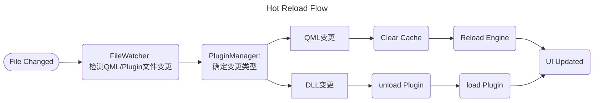
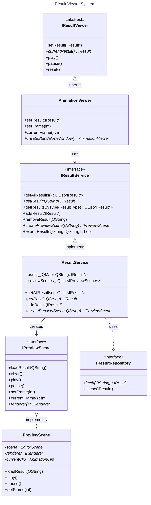

# RGC Editor in V0.3.0

本次更新对Editor的主要需求：

- [x] 接入RBCRuntime中的场景定义
- [x] 更新灵活的Workflow
- [x] 引入QML进行组件封装与样式定义
- [x] 支持样式热加载与调试模式（argv控制）
- [x] 支持通用Plugin(DLL)加载与热更新
- [x] 基于Plugin的MVVM架构，支持模块动态load/unload
- [x] 更科学的大型Qt项目组织，支持子模块mock和可复用Component独立开发
- [ ] 支持调试渲染参数的Detail面板
- [ ] 实现RBCProject的结构管理

## 架构设计核心问题

QML生命周期管理

直接在`main.qml`中加载`Window`组件会导致生命周期问题：
- QML Window的创建和销毁时机不受C++控制
- 多窗口管理困难
- 与Plugin热更新机制冲突

解决方案：
- **所有QML都以Component形式加载**，不使用QML直接创建Window
- C++端创建和管理`QQuickWindow`/`QQuickView`
- QML仅定义视图内容和样式，不涉及窗口生命周期
- 通过PluginManager统一管理所有UI模块的加载/卸载

Plugin-Based MVVM


整体数据流遵循以下模式：

```
UI Event → Controller → Service → Repository → EventBus → Widget
```

**各层职责**：
- **UI Event**：用户交互触发的事件（点击、输入等）
- **Controller**：处理UI事件，协调Service调用，不包含业务逻辑
- **Service**：业务逻辑层，处理具体业务操作
- **Repository**：数据访问层，负责数据的持久化和缓存
- **EventBus**：事件总线，实现组件间松耦合通信
- **Widget**：UI组件，响应事件更新显示

## Plugin系统设计

- IEditorPlugin
  - load
  - unload
  - reload
  - id
  - name
  - version
  - dependencies
  - viewContributions
  - menuContributions
  - toolbarContributions
  - registerViewModels
- PluginManager
  - loadPlugin
  - unloadPlugin
  - reloadPlugin
  - getPlugin
  - getLoadedPlugins
  - getPluginsByCategory
  - enableHotReload
  - isHotReloadEnabled
  - watchPluginDirectory
  - registerService
  - getService
  - setQmlEngine
  - qmlEngine
  - pluginLoaded
  - resolvePluginDependencies
- PluginContext
  - eventBus
  - sceneService
  - layoutService
  - styleManager
  - resultService
  - qmlEngine
  - resolveQmlUrl

## MVVM架构

**为什么采用MVVM而非MVC/MVP?**
- **数据绑定友好**：QML的声明式绑定与MVVM天然契合，减少样板代码
- **View与逻辑分离**：QML只负责UI表现，ViewModel处理所有逻辑
- **可测试性**：ViewModel可以独立于View进行单元测试
- **热更新支持**：View(QML)可以热重载而不影响ViewModel状态

ViewModelBase
- isBusy
- onActivate
- onDeactivate
- onReload
- setBusy
- setError
- clearError
- publish
- subscribe
- unsubscribe
- isBusyChanged
- errorMessageChanged

e.g ViewportViewModel
- properties
  - cameraMode
  - showGrid
  - showGizmo
  - cameraPosition
- qml

## 服务层设计

### 2. EventBus（事件总线）

IEventBus
- publish
- subscribe
- unsubscribe
- eventPublished
- myViewModel
  - init
  - selectEntity

### 3. SceneService（场景服务）

- ISceneService
  - getEntity
  - addEntity
  - removeEntity
  - selectEntity
  - isDirty
  - entityAdded
  - entityRemoved
  - entitySelected
  - sceneChanged


### 4. StyleManager（样式管理）

详见"热更新系统"章节。

## 窗口与视图管理

### 1. C++端窗口管理

WindowManager
- mainWindow
- setupMainWindow
- createDockableView
- createStandaloneView
- findView
- showView
- hideView
- closeView
- saveLayout
- loadLayout
- resetLayout
- createQmlContainer

### 2. QML容器实现

QmlViewContainer
- reloadQml
- viewModel
- setViewModel
- loadQmlComponent
- clearQmlComponent
- QmlViewContainer
- realodQml

## 热更新系统

### 1. 热更新原理



### 2. StyleManager（QML热重载核心）

StyleManager
- initialize
- isHotReloadEnabled
- resolveUrl
- qmlEngine
- setSourceRoot
- sourceRoot
- reloadAll
- reloadComponent
- signals
  - styleReloaded
  - componentReloaded
  - reloadError
- slots
  - onFileChanged
  - onDirectoryChanged
  - onDebounceTimer
- setupFileWatcher
- watchDirectory
- resolveUrl

### 3. Plugin DLL热更新

(WIP)

## 特别案例：Animation Playback 模块重构

### 1. 当前问题分析

当前动画播放功能存在以下严重的架构问题：

**问题1：职责分散且耦合严重**
- `AnimationPlayer`：UI控件（播放控制）
- `AnimationPlaybackManager`：实际播放逻辑（应用变换）
- `AnimationController`：控制器（连接两者）
- `ResultPanel`：显示动画列表
- `EditorScene`：接收动画变换

这5个组件通过`EditorContext`强耦合，难以独立测试和复用。

**问题2：与主场景编辑器耦合**
- 动画播放直接修改`EditorScene`
- 无法独立预览动画而不影响主编辑场景
- 无法同时查看多个动画结果
- 无法在独立窗口中查看动画

**问题3：缺乏灵活性**
- 不支持多个动画结果的对比查看
- 不支持独立窗口播放
- 不支持动画导出预览
- 不支持时间轴高级编辑

**问题4：测试困难**
- 组件高度耦合，难以Mock
- 播放逻辑与UI混合
- 无法独立测试播放逻辑

### 2. 新设计：独立的结果查看器系统

#### 2.1 核心设计思想

1. **独立的预览场景**：动画播放使用独立的Scene实例，不影响主编辑场景
2. **模块化的查看器**：支持嵌入式和独立窗口两种模式
3. **统一的结果管理**：通过ResultService管理所有类型的执行结果（动画、图片、视频等）
4. **清晰的分层**：Viewer（UI）→ Service（逻辑）→ Repository（数据）

#### 2.2 新架构设计




#### 2.3 接口设计

ResultType
- Animation
- Image
- Video
- Mesh
- PointCloud
- Custom

ResultMetadata
- id
- name
- type
- sourceNode
- timestamp
- properties

AnimationResultData
- name
- totalFrames
- fps
- clip
- entityIds

IResult

AnimationResult

IResultService
- getAllResults
- getResult
- getResultsByType
- addResult
- removeResult
- clearResults
- createPreviewScene
- destroyPreviewScene
- exportResult
- resultAdded
- resultRemoved
- resultCleared

IPreviewScene
- loadResult
- clear
- play
- pause
- setFrame
- currentFrame
- isPlaying
- renderer
- resultId
- resultType

IResultViewer
- play
- pause
- reset

AnimationViewer: IResultViewer

ResultBrowserPanel

ResultService

#### 2.4 使用场景示例

**场景1：在主窗口中嵌入式查看动画结果**
**场景2：独立窗口预览，不影响主场景**
**场景3：对比多个动画结果**

#### 2.5 新架构的优势

**1. 完全解耦主编辑场景**
- 预览使用独立的`PreviewScene`
- 主场景编辑不受动画播放影响
- 可以同时编辑场景和预览动画

**2. 灵活的显示模式**
- 嵌入式查看器：集成在主窗口Dock中
- 独立窗口：弹出独立窗口预览
- 对比模式：并排对比多个结果

**3. 统一的结果管理**
- 所有类型的结果（动画、图片、视频）统一管理
- 便于添加新的结果类型
- 支持结果导出、缓存、历史记录

**4. 易于测试**
```cpp
// Mock测试示例
class MockResultService : public IResultService {
    MOCK_METHOD(QList<IResult*>, getAllResults, (), (const, override));
    MOCK_METHOD(IResult*, getResult, (const QString&), (const, override));
    // ...
};

TEST(AnimationViewerTest, LoadAnimation) {
    MockResultService mockService;
    AnimationViewer viewer(&mockService);
    
    auto mockResult = createMockAnimationResult();
    EXPECT_CALL(mockService, getResult("test-id"))
        .WillOnce(Return(mockResult));
    
    viewer.setResult(mockResult);
    
    EXPECT_EQ(viewer.currentResult(), mockResult);
}
```

**5. 可扩展性强**
- 新增结果类型只需实现`IResult`接口
- 新增查看器只需实现`IResultViewer`接口
- 支持插件式的结果处理器

#### 2.6 目录结构

```
rbc/editor/runtime/
├── include/RBCEditorRuntime/
│   ├── results/                         # 结果系统（新增）
│   │   ├── domain/                      # 领域模型
│   │   │   ├── IResult.h
│   │   │   ├── AnimationResult.h
│   │   │   ├── ImageResult.h
│   │   │   └── ResultMetadata.h
│   │   │
│   │   ├── services/                    # 服务层
│   │   │   ├── IResultService.h
│   │   │   ├── ResultService.h
│   │   │   ├── IPreviewScene.h
│   │   │   └── PreviewScene.h
│   │   │
│   │   ├── viewers/                     # 查看器（UI层）
│   │   │   ├── IResultViewer.h
│   │   │   ├── AnimationViewer.h
│   │   │   ├── ImageViewer.h
│   │   │   ├── ResultBrowserPanel.h
│   │   │   └── AnimationComparisonWindow.h
│   │   │
│   │   ├── qml/                         # QML视图实现
│   │   │   ├── ResultViewer.qml
│   │   │   └── Controls/
│   │   │
│   │   └── repositories/                # 数据访问
│   │       ├── IResultRepository.h
│   │       └── ResultRepository.h
│   │
│   └── components/                      # 保留的组件（简化）
│       ├── AnimationTimeline.h          # 纯UI组件（时间轴控件）
│       └── PlaybackControls.h           # 纯UI组件（播放控制）
```

## 目录结构

```
rbc/editor/
├── runtime/
│   ├── include/RBCEditorRuntime/
│   │   ├── core/                          # 核心框架
│   │   │   ├── EditorEngine.h
│   │   │   └── EditorApplication.h
│   │   │
│   │   ├── plugins/                       # Plugin系统
│   │   │   ├── IEditorPlugin.h
│   │   │   ├── PluginManager.h
│   │   │   ├── PluginContext.h
│   │   │   ├── DynamicPlugin.h
│   │   │   └── PluginContributions.h
│   │   │
│   │   ├── mvvm/                          # MVVM基础设施
│   │   │   ├── ViewModelBase.h
│   │   │   └── BindingHelpers.h
│   │   │
│   │   ├── services/                      # 服务层
│   │   │   ├── IEventBus.h
│   │   │   ├── EventBus.h
│   │   │   ├── ISceneService.h
│   │   │   ├── SceneService.h
│   │   │   ├── IStyleManager.h
│   │   │   ├── StyleManager.h
│   │   │   ├── ILayoutService.h
│   │   │   ├── LayoutService.h
│   │   │   ├── IResultService.h
│   │   │   └── ResultService.h
│   │   │
│   │   ├── ui/                            # UI框架
│   │   │   ├── WindowManager.h
│   │   │   ├── QmlViewContainer.h
│   │   │   └── RenderSurface.h
│   │   │
│   │   ├── infrastructure/                # 基础设施
│   │   │   ├── events/
│   │   │   │   ├── Event.h
│   │   │   │   └── EventType.h
│   │   │   ├── network/
│   │   │   ├── rendering/
│   │   │   └── repository/
│   │   │       ├── SceneRepository.h
│   │   │       └── AnimationRepository.h
│   │   │
│   │   └── results/                       # 结果系统
│   │       └── ...                        # 见Animation Playback章节
│   │
│   ├── src/                               # 实现文件
│   │
│   └── qml/                               # QML资源
│       ├── components/                    # 通用QML组件
│       │   ├── Button.qml
│       │   ├── Panel.qml
│       │   └── ...
│       ├── styles/                        # 样式定义
│       │   ├── Theme.qml
│       │   └── Colors.qml
│       └── views/                         # 视图（由Plugin引用）
│
├── plugins/                               # 内置插件
│   ├── core_plugin/                       # 核心插件（菜单、工具栏等）
│   │   ├── CorePlugin.h
│   │   ├── CorePlugin.cpp
│   │   └── qml/
│   │
│   ├── viewport_plugin/                   # 视口插件
│   │   ├── ViewportPlugin.h
│   │   ├── ViewportViewModel.h
│   │   ├── ViewportViewModel.cpp
│   │   └── qml/
│   │       └── ViewportView.qml
│   │
│   ├── hierarchy_plugin/                   # 场景层级插件
│   │   ├── HierarchyPlugin.h
│   │   ├── HierarchyViewModel.h
│   │   └── qml/
│   │
│   ├── detail_plugin/                     # 属性面板插件
│   │   ├── DetailPlugin.h
│   │   ├── DetailViewModel.h
│   │   └── qml/
│   │
│   ├── node_editor_plugin/                # 节点编辑器插件
│   │   ├── NodeEditorPlugin.h
│   │   ├── NodeEditorViewModel.h
│   │   └── qml/
│   │
│   └── result_viewer_plugin/              # 结果查看器插件
│       ├── ResultViewerPlugin.h
│       ├── ResultViewModel.h
│       └── qml/
│
├── editor/                                # 主程序入口
│   └── main.cpp
│
└── tests/                                 # 测试
    ├── plugins/
    ├── mvvm/
    └── mocks/
```

## 启动流程

(WIP)

## 命令行参数

```
RoboCuteEditor.exe [options]

Options:
  --qml-dev              启用QML热重载模式（从源码目录加载QML）
  --qml-source <path>    指定QML源码根目录（默认：./rbc/editor/runtime/qml）
  --plugin-dir <path>    额外的插件搜索目录
  --no-plugins           禁用外部插件加载
  --layout <name>        使用指定的布局配置
  --connect <host:port>  自动连接到Python Server
  --headless             无头模式（用于测试）
  --verbose              详细日志输出

示例：
  # 开发模式，启用QML热重载
  RoboCuteEditor.exe --qml-dev --qml-source D:/ws/repos/RoboCute-repo/RoboCute/rbc/editor/runtime/qml
  
  # 加载自定义插件目录
  RoboCuteEditor.exe --plugin-dir ./custom_plugins
  
  # 无头模式运行测试
  RoboCuteEditor.exe --headless --no-plugins
```

## 测试策略

### 1. ViewModel单元测试

```cpp
// tests/mvvm/test_viewport_viewmodel.cpp
class MockSceneService : public ISceneService {
    Q_OBJECT
public:
    MOCK_METHOD(Entity*, getEntity, (int), (const, override));
    MOCK_METHOD(void, selectEntity, (int), (override));
    MOCK_METHOD(int, selectedEntityId, (), (const, override));
    // ...
};

class ViewportViewModelTest : public QObject {
    Q_OBJECT
    
private slots:
    void test_selectEntity_updatesSelection() {
        MockSceneService mockScene;
        ViewportViewModel vm(&mockScene, nullptr);
        
        EXPECT_CALL(mockScene, selectEntity(42));
        EXPECT_CALL(mockScene, selectedEntityId())
            .WillRepeatedly(Return(42));
        
        vm.selectEntity(42);
        
        QCOMPARE(vm.selectedEntityId(), 42);
    }
    
    void test_selectEntity_emitsSignal() {
        MockSceneService mockScene;
        ViewportViewModel vm(&mockScene, nullptr);
        
        QSignalSpy spy(&vm, &ViewportViewModel::selectionChanged);
        
        vm.selectEntity(42);
        
        QCOMPARE(spy.count(), 1);
    }
    
    void test_cameraMode_change() {
        MockSceneService mockScene;
        ViewportViewModel vm(&mockScene, nullptr);
        
        QSignalSpy spy(&vm, &ViewportViewModel::cameraModeChanged);
        
        vm.setCameraMode("fps");
        
        QCOMPARE(vm.cameraMode(), QString("fps"));
        QCOMPARE(spy.count(), 1);
    }
};
```

### 2. Plugin集成测试

```cpp
// tests/plugins/test_plugin_lifecycle.cpp
class PluginLifecycleTest : public QObject {
    Q_OBJECT
    
private slots:
    void test_loadUnloadPlugin() {
        PluginManager manager;
        auto* testPlugin = new TestPlugin();
        
        // Load
        QVERIFY(manager.loadPlugin(testPlugin));
        QCOMPARE(manager.getLoadedPlugins().size(), 1);
        QCOMPARE(manager.getPlugin("test"), testPlugin);
        
        // Unload
        QVERIFY(manager.unloadPlugin("test"));
        QCOMPARE(manager.getLoadedPlugins().size(), 0);
    }
    
    void test_hotReload() {
        PluginManager manager;
        manager.enableHotReload(true);
        
        auto* plugin = new TestPlugin();
        manager.loadPlugin(plugin);
        
        QSignalSpy spy(&manager, &PluginManager::pluginReloaded);
        
        manager.reloadPlugin(plugin->id());
        
        QCOMPARE(spy.count(), 1);
    }
    
    void test_pluginDependencies() {
        PluginManager manager;
        
        // 加载依赖插件
        auto* depPlugin = new DependencyPlugin();
        manager.loadPlugin(depPlugin);
        
        // 加载依赖它的插件
        auto* mainPlugin = new MainPlugin();
        QVERIFY(manager.loadPlugin(mainPlugin));
        
        // 卸载依赖插件应该失败
        QVERIFY(!manager.unloadPlugin(depPlugin->id()));
    }
};
```

### 3. 服务层测试

```cpp
// tests/services/test_result_service.cpp
class ResultServiceTest : public QObject {
    Q_OBJECT
    
private slots:
    void test_addAndGetResult() {
        ResultService service;
        
        auto result = createTestAnimationResult();
        service.addResult(std::move(result));
        
        auto* retrieved = service.getResult("test-id");
        QVERIFY(retrieved != nullptr);
        QCOMPARE(retrieved->type(), ResultType::Animation);
    }
    
    void test_createPreviewScene() {
        ResultService service;
        service.addResult(createTestAnimationResult());
        
        auto* scene = service.createPreviewScene("test-id");
        QVERIFY(scene != nullptr);
        QCOMPARE(scene->resultId(), QString("test-id"));
        
        service.destroyPreviewScene(scene);
    }
};
```

## 架构演进：从旧架构到新架构

### 1. 重构前的问题

**问题1：MainWindow承担过多职责**
**问题2：组件间通信耦合严重**

### 2. 重构后的改进

**改进1：职责清晰，依赖注入**
**改进2：通过Service和EventBus通信，松耦合**

### 3. 重构带来的好处

1. **解耦**：组件不再直接依赖其他组件，通过Service和EventBus通信
2. **可测试**：Service可以Mock，便于单元测试
3. **可扩展**：新功能可以作为Plugin添加，不影响现有代码
4. **可维护**：职责清晰，代码组织更合理

## 总结

新架构的核心优势：

1. **生命周期可控**：C++管理所有窗口生命周期，QML仅作为View组件
2. **热更新友好**：Plugin机制支持DLL和QML的动态重载
3. **高度模块化**：每个功能模块都是独立Plugin，可单独开发测试
4. **MVVM清晰**：ViewModel持有状态和逻辑，View(QML)只负责展示
5. **依赖注入**：通过PluginContext注入服务，便于测试和Mock
6. **扩展性强**：外部开发者可以通过Plugin扩展Editor功能
7. **松耦合**：组件通过Service和EventBus通信，降低耦合度
8. **可测试性**：各层职责清晰，便于单元测试和集成测试
